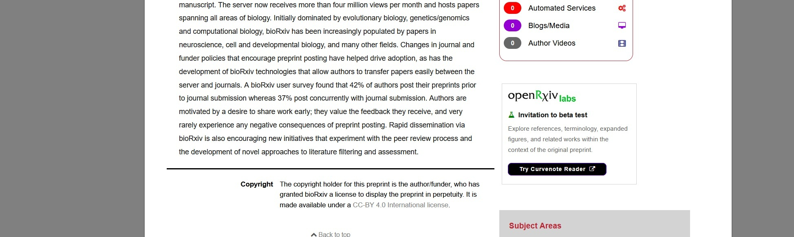

Last month, we [launched openRxiv Labs Curvenote Reader](https://reader.openrxivlabs.org/), a new way to explore preprints interactively, 
as the first of our [openRxiv Labs experiments](https://openrxivlabs.org/curvenote-reader). After a few weeks of testing, analyzing early metrics, 
and monitoring early feedback, we’re excited to expand the experiment to include direct links from preprints 
on the main bioRxiv site to the Reader version via a new button in the right-hand sidebar. For now, this button 
will appear 48 hours after a preprint is posted to ensure the full-text version is available. Over time, 
we’ll work to improve this process so the button appears as soon as the Reader version is available.

One of the early pieces of feedback [we received](https://ripplingideas.org/2026/06/03/openrxiv-labs-so-what/) from Dr. Jonny Coates was to be specific and transparent about how we’re assessing 
these experiments, which is a core part of our [openRxiv Labs Criteria](https://openrxivlabs.org/about). This expansion is an ideal opportunity to provide an update 
on the progress of the experiment so far.

At launch, we [hypothesized](https://openrxivlabs.org/curvenote-reader#hypothesis): “a connected reading experience, built on structured content already maintained by the archive, will 
help readers engage more deeply with preprints and discover related research without extra friction.”

In the first phase of the experiment, we’ve been looking primarily at whether the Reader user experience is useful to the users 
who have engaged with it, to assess whether we should expand it beyond the relatively small number who discovered it via our 
blog or social media channels. The primary measurement we’ve been using is engagements with the connected elements in Reader: citations 
that pull in abstracts and figures, annotations, image zooming, and similar user interactions. 

Based on our past experience of typical engagement with these kinds of features across the web, we expected 10-15% of readers to 
engage with these elements, with an average of 3 engagements per engaged user.

Encouragingly, so far 29% of users have engaged with a connected feature, with an average of 3.7 engagements per user, exceeding 
our initial expectations. On average, a user’s first engagement starts just 18 seconds after the page loads, indicating a very 
quick learning curve. And although we’re not yet focusing on retention, we found that a healthy 7.4% of users returned to Reader 
the following week.

In the next phase of the experiment, we’re testing whether a broader audience is interested in Reader, and if so, whether their 
engagement with its connected features is similar (we expect a modest decrease with a larger, less self-selecting user base). Our 
goals for the next several weeks are to see a click-through rate of 1-2% on the bioRxiv Reader button, a decrease of no more than 
10% in engagements per user on Reader, and no significant drop in week-over-week retention over time. Together, these results would 
indicate that Reader is interesting to a significant segment of the bioRxiv audience, offers a useful user experience, and is valuable 
enough that a significant segment of users choose Reader for their habitual preprint reading.

We’ll write with another update once we’ve had time to assess the results of the button. In the meantime, we value your continued 
feedback on this experiment. Feel free to reach out via [email](mailto:hello@openrxiv.org?subject=openRxiv+Labs+Curvenote+Reader), [Bluesky](https://bsky.app/profile/openrxiv.bsky.social), 
the [GitHub Repo](https://github.com/openrxivlabs/curvenote-reader/issues) for the experiment, or by submitting an issue 
using the feedback button on the bottom of every Reader page.
